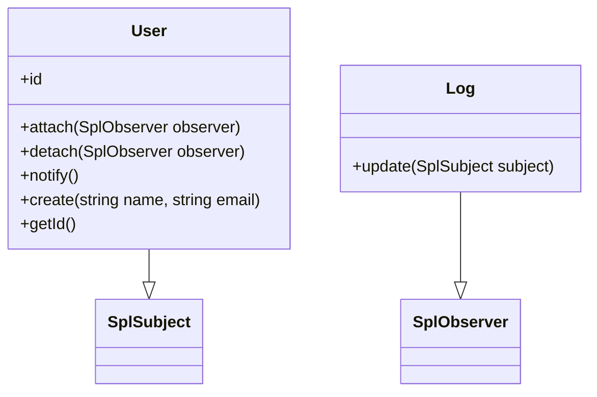

# Design Patterns Observer

## Intérêt 

Ce pattern est très utile pour déclencher une/des action(s) en fonction d'une autre. Par exemple, si un utilisateur commande un produit, on notifie cette commande dans une table spécifique pour faire des statistiques sur les achats. On peut également notifier d'autres informations en fonction de l'achat, et cela sans modifier le code de la classe observée.

L'Observer est donc une solution modulable, évolutive et testable pour ce type de problème, par exemple.

### Partie 1 : mise en place du Pattern

- L'interface **SplSubject** de PHP. Cette interface définit une classe donnée comme observable (Subject), elle devra donc implémenter (interface) des méthodes spécifiques (attach, detach et notify):

```php
class User implements SplSubject {
    
    // ... (le reste du code reste inchangé)
}
```

Voyons maintenant une classe observeur (Observer) avec l'interface SplObserver (méthode update) de PHP :

```php
class Log implements SplObserver {
    
    // ... (le reste du code reste inchangé)
}
```

## Diagramme UML



Maintenant, si vous créez un utilisateur, la méthode create de User le notifie à son/ses observateur(s) :

:rocket:
```php
$subject = new User;
$subject->attach(new Log );

// crée un nouvel utilisateur => notification 
$subject->create('Alan', 'alan@alan.fr');
```

Ajoutez maintenant un deuxième Observer et vérifiez que celui-ci observe la création de votre utilisateur.

Par exemple, faites un Observer de type Storage qui push l'id de l'utilisateur créé dans un tableau.

###  Partie 2 : Cart Observer

*Vous devez implémenter ce design pattern et faire une campagne de tests unitaires documentée et structurée. Vous devez être en mesure lors de la correction d'expliciter votre démarche en vous appuyant sur votre documentation.*

Présentez les tests dans un fichier à part pour expliciter vos tests.

Pour cet exercice, respectez l'organisation du composant Cart suivante :


Soient les classes Cart, Product et les observeurs LogFile et LogSum. La classe Cart sera la classe Subject (Observable).

>[!NOTE]
> Remarque : pour la classe Cart, utilisez un tableau PHP comme storage, nous utiliserons ici une version plus simple de cette classe que nous avons déjà vue. Voyez dans la partie annexe pour le code de la classe Cart et son Storage.
